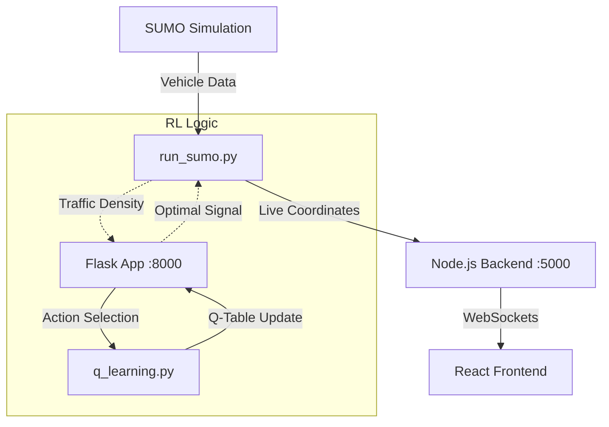

# Reinforcement Learning Model Analysis (`rl_model`)

The `rl_model` directory contains the core logic for the adaptive traffic control system, using Q-learning to optimize signal timings based on real-time traffic density.

## Component Overview

### 1. Q-Learning Implementation (`q_learning.py`)
This file defines the `TrafficRL` class, which handles the learning logic.

- **State Representation**: The state is a single integer (0-99) representing the total vehicle count across all lanes.
- **Action Space**:
  - `0`: North-South Green
  - `1`: East-West Green
- **Reward Function**: `reward = -sum(traffic_counts)`. This ensures the agent is penalized for high congestion.
- **Learning Mechanism**: Uses a standard Q-table with:
  - `alpha` (Learning Rate): 0.1
  - `gamma` (Discount Factor): 0.9
  - `epsilon` (Exploration Rate): 0.1

### 2. Model Server (`app.py`)
A Flask API that provides an interface to the Q-learning model.

- **Port**: 8000
- **Endpoint**: `/get_signal` (POST)
- **Workflow**:
  1. Receives traffic data.
  2. Maps data to a state.
  3. Chooses the optimal action (signal).
  4. Updates the Q-table based on the observed reward.
  5. Returns the chosen signal (`NS_GREEN` or `EW_GREEN`).

### 3. SUMO Simulation (`sumo_sim/`)
This folder contains the physical simulation environment using the SUMO (Simulation of Urban MObility) suite.

- **Configuration Files**: `.net.xml` (network), `.rou.xml` (routes), and `.sumocfg` (simulation config).
- **Controller (`run_sumo.py`)**:
  - Uses `traci` to connect to the SUMO GUI.
  - **Live Updates**: Sends vehicle coordinates and signal states to the Node.js backend (port 5000) every 0.1s.
  - **Decision Logic**: Currently uses a greedy heuristic (lines 77-78) to switch signals based on which side has more traffic.

## Integration Flow

> [!NOTE]
> The `run_sumo.py` script is currently configured to send live data to the Node.js server to visualize the simulation on the web dashboard. While the Flask app (`app.py`) is ready to serve the RL model, the simulation script is currently using a simpler density-based heuristic for decisions.
